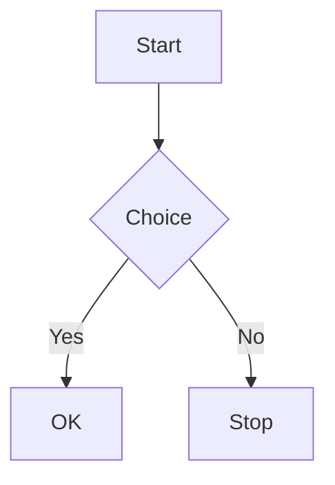
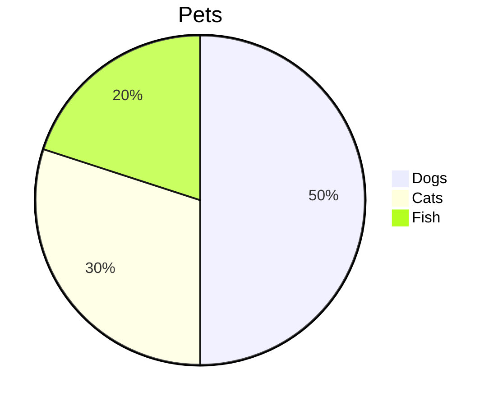

# Thymer Markdown Preview

A [Thymer](https://thymer.com) **App Plugin** that shows a read-only, live-rendered Markdown preview of the current record in a separate panel.

## Features

- **Status bar toggle** — “MD Preview” with icon in the app footer; click to open or close the preview panel.
- **Live preview** — Renders the active record as Markdown (GitHub Flavored Markdown, tables, code, etc.).
- **Auto-refresh** — Updates when you switch records or when content is edited.
- **Tables** — Headings and blocks are kept outside tables; header row and alternating row styling; selectable text.
- **Mermaid diagrams** — Fenced code blocks labeled `mermaid` are rendered as flowcharts, sequence diagrams, pie charts, and other Mermaid chart types; multiple diagrams per record; theme selector (Light/Dark presets); all diagrams use the same fixed frame size so they appear proportionally similar.
- **Safe rendering** — HTML is sanitized with DOMPurify when available.
- **Dark mode** — Table, preview, and Mermaid colors adapt to `prefers-color-scheme: dark` and Thymer’s theme variables via CSS custom properties.

## How to use

1. Install or enable the plugin in Thymer (Global Plugin).
2. Open a record whose content is (or includes) Markdown.
3. In the **status bar** (footer), click **MD Preview** to open the preview panel.
4. Click **MD Preview** again to close the panel. Closing the panel via the app’s close button also turns off the status bar highlight.

Preview content is selectable and copyable.

### Panel layout

- The preview panel opens in the **rightmost pane**. After you select a record, the plugin keeps the **first (left) pane** active so the **next** record you open opens in the left pane and does not overlay the preview.

### Mermaid diagrams

- **Fenced blocks only**: Use fenced code blocks with the `mermaid` language; plain text starting with `mermaid` is not rendered.
- **Graph alias**: `graph LR` and similar are automatically normalized for compatibility.
- **Indentation**: Opening and closing fences may be indented; diagram body is dedented so indented and non-indented blocks both work. If the host serializes with the closing fence right after the first line, the plugin still collects the rest of the diagram when it looks like Mermaid content.
- **Theme**: Use the toolbar dropdown to pick a Mermaid theme (Auto, Light 1–3, Dark 1–3).
- **Sizing**: All diagrams are rendered in the same fixed square frame so they appear the same size in relation to each other; content scales to fit.
- **Multiple diagrams**: You can have more than one Mermaid block in a single record, each with its own opening and closing fences.

Basic example:

Flowcharts, sequence diagrams, pie charts, and other [Mermaid](https://mermaid.js.org/) chart types are supported.

## Files

| File        | Purpose |
|------------|---------|
| `plugin.js` | Plugin logic: status bar item, panel (rightmost, first-pane active), marked + DOMPurify + Mermaid loading, table normalization, Mermaid extraction and render, theme presets, diagram frame sizing. |
| `plugin.css` | Styles for toolbar, preview area, markdown content, tables, Mermaid containers (fixed frame), dark mode. |
| `plugin.json` | Plugin manifest and collection config (name, views, fields, etc.). |

## Dependencies

The plugin loads from CDN at runtime:

- **marked** (v9) — Markdown to HTML.
- **DOMPurify** (v3) — HTML sanitization.
- **Mermaid** (v9) — Diagram rendering from fenced `mermaid` code blocks (theme-aware `themeVariables`; diagrams scaled to a common frame).

No build step is required; use the files as-is in Thymer’s plugin editor or your own build if you have one.

## License

Use and modify as needed for your workspace. Check Thymer’s plugin terms for distribution.
