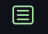
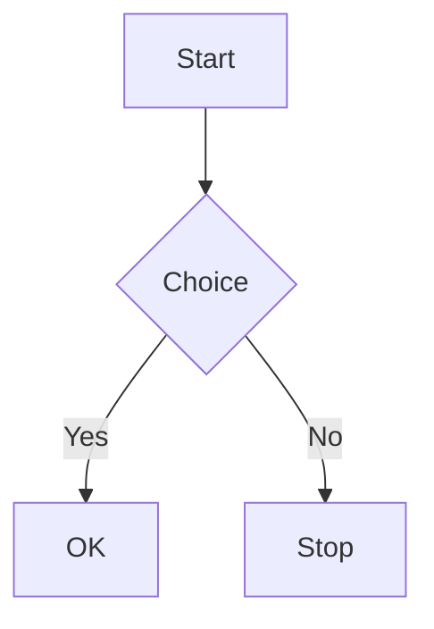
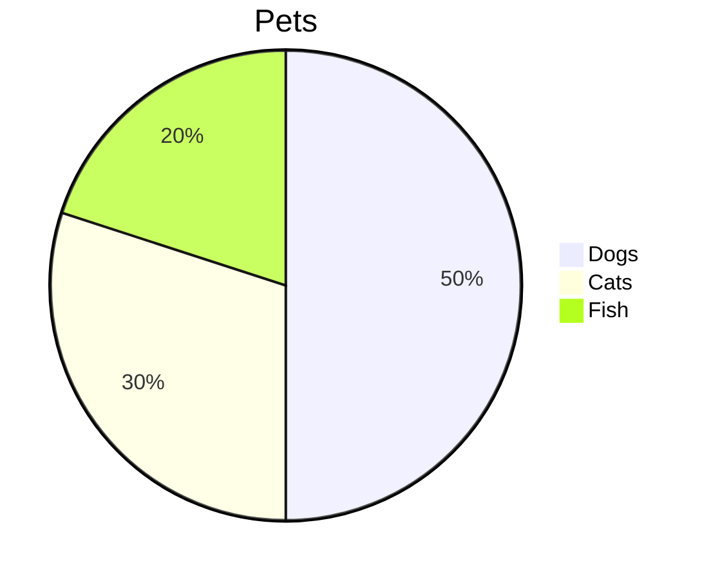

# Thymer Markdown Preview

A [Thymer](https://thymer.com) **App Plugin** that shows a read-only, live-rendered Markdown preview of the current record in a separate panel.

## Features

- **Status bar toggle** — article icon in the app footer; click to open or close the preview panel.
- **Live preview** — Renders the active record as GitHub Flavored Markdown (tables, code, blockquotes, bold/italic, etc.).
- **Auto-refresh** — Updates when you switch records or when content is edited.
- **Zoom controls** — Compact `−` / `100%` / `+` button group in the toolbar. Double-click the `%` label to reset to 100 %. Ctrl/Cmd + scroll wheel also zooms. Range: 40 %–250 %.
- **Export to PDF** — **PDF** button in the toolbar exports the rendered preview to PDF via the browser print dialog. Focus is set to the preview panel automatically before printing.
- **Word count** — Live word count shown next to the record title in the toolbar; counts from rendered text (Markdown syntax excluded).
- **Tables** — Four selectable style presets (Hi-Contrast, Monochrome, Blue Stripe, Auto); row hover highlighting; selectable text.
- **Colorblind-safe styling** — Table styles and Mermaid diagram themes are built on the [Okabe-Ito](https://jfly.uni-koeln.de/color/) palette. Avoids red/green as dominant hues. Colors are fully hardcoded so the preview looks the same regardless of which Thymer theme is active.
- **Mermaid diagrams** — Fenced `mermaid` blocks are rendered as flowcharts, sequence diagrams, pie charts, and other Mermaid chart types. Each diagram is shown in a styled card whose background color matches the active preset. Sequence diagram lifelines, signal arrows, loop labels, and note text are all colorblind-safe and readable. Pie chart segment borders are enforced for contrast.
- **Adaptive light/dark diagrams** — Every named Mermaid preset carries both a `light` and `dark` color variant; the correct one is selected automatically based on the OS `prefers-color-scheme` setting.
- **Safe rendering** — HTML is sanitized with DOMPurify when available.
- **Deferred loading** — CDN libraries are not loaded at Thymer startup. Marked and DOMPurify load when the preview panel opens; Mermaid loads only when a diagram is detected. All loads have a 10-second timeout to prevent Thymer from hanging on slow or unreachable CDNs.

## How to use

1. Install or enable the plugin in Thymer (Global Plugin).
2. Open a record whose content is (or includes) Markdown.
3. In the **status bar** (footer), click  to open the preview panel.
4. Click  again to close the panel. Closing the panel via the app's close button also turns off the status bar highlight.


### Panel layout

The preview panel opens in the **rightmost pane**. After you select a record, the plugin keeps the **first (left) pane** active so the next record you open does not overlay the preview.

---

## Table styles

Use the **"Table: …"** dropdown in the toolbar to switch between four presets. The selection applies immediately; no reload needed.

| Preset | Header | Odd rows | Even rows | Row hover |
|---|---|---|---|---|
| **Hi-Contrast** (default) | Navy `#1e3a5f` / white text | White | Sky blue `#e8f4fd` | Amber `#fef3c7` |
| **Monochrome** | Black `#111827` / white text | White | Light gray `#f3f4f6` | Gray `#e5e7eb` |
| **Blue Stripe** | Blue `#1d4ed8` / white text | White | Pale blue `#dbeafe` | Blue `#bfdbfe` |
| **Auto** | Inherits Thymer theme variables | White | `#f1f5f9` | Near-white |

Hi-Contrast, Monochrome, and Blue Stripe use fully hardcoded hex values unaffected by Thymer's active theme. Each preset adapts automatically for dark mode via `prefers-color-scheme`. The **Auto** preset reads Thymer's CSS custom properties for users who prefer theme-inherited colors.

The row hover highlight lets you track the current row without relying on color alone — useful for wide tables.

---

## Mermaid diagrams

Use the **"Mermaid: …"** dropdown in the toolbar to switch between colorblind-safe theme presets. All presets are built on the [Okabe-Ito](https://jfly.uni-koeln.de/color/) palette and avoid red/green as primary distinguishing hues.

| Preset | Light colors | Dark colors | Best for |
|---|---|---|---|
| **CB: Blue/Slate** (default) | Sky-blue fills, dark navy lines | Deep navy bg, sky lines | All colorblindness types |
| **CB: Orange/Blue** | Warm orange fills, Okabe blue lines | Dark bg, amber lines | Deuteranopia, Protanopia |
| **CB: Purple/Amber** | Lavender fills, purple lines | Deep purple bg, violet lines | All colorblindness types |
| **CB: Dark Blue** | Always dark — navy fills, sky blue lines | (same) | Dark display preference |
| **CB: Dark Amber** | Always dark — charcoal fills, amber lines | (same) | Dark display preference |
| **Auto** | Reads host theme CSS variables | (same via media query) | — |

Each named preset automatically selects its `light` or `dark` color variant based on `prefers-color-scheme`. Switching presets reinitializes Mermaid and re-renders all diagrams instantly.

### What each preset controls

Every named preset explicitly sets all **12** Mermaid CSS custom properties, so switching presets fully resets every color with no stale values:

| CSS variable | Controls |
|---|---|
| `--md-mermaid-bg` | Diagram card background |
| `--md-mermaid-primary` | Node / box fill |
| `--md-mermaid-secondary` | Secondary node fill |
| `--md-mermaid-tertiary` | Tertiary / background fill |
| `--md-mermaid-line` | Arrow and connector lines |
| `--md-mermaid-primary-text` | Primary node text |
| `--md-mermaid-secondary-text` | Secondary node text |
| `--md-mermaid-actor-text` | Sequence diagram actor box text |
| `--md-mermaid-note-text` | Note box text (always dark — note bg is always light yellow) |
| `--md-mermaid-signal-text` | Sequence diagram arrow labels |
| `--md-mermaid-label-text` | Loop / alt / opt box labels |
| `--md-mermaid-actor-line` | Sequence diagram lifelines (vertical dashed lines) |

### Diagram cards

Each diagram is rendered inside a styled card: rounded corners (10 px), 16 px padding, and a subtle drop shadow. The card background is set by `--md-mermaid-bg` so it always matches the active preset's palette.

### Sequence diagram lifelines

Lifeline stroke color and width are enforced via JavaScript post-processing after each render, using geometry-based detection (vertical `<line>` elements where `x1 ≈ x2`) rather than CSS class names, which vary across Mermaid versions. This ensures lifelines remain visible regardless of Mermaid's embedded SVG styles or Thymer's host CSS.

### Pie chart borders

Pie chart segment borders are enforced via CSS and JavaScript post-processing. Dark backgrounds use `rgba(255,255,255,0.65)` borders; light backgrounds use `rgba(0,0,0,0.25)`.

### Fenced block syntax

- **Fenced blocks only**: Use ` ```mermaid ` fenced code blocks; plain text starting with `mermaid` is not rendered.
- **Graph alias**: `flowchart LR` and similar are automatically normalized.
- **Indentation**: Opening and closing fences may be indented; the diagram body is dedented automatically.
- **Serialization quirk**: If the host closes the fence immediately after the first declaration line, the plugin continues collecting subsequent diagram lines.
- **Multiple diagrams**: Any number of Mermaid blocks per record, each with its own fences.

Basic examples:


```mermaid
graph TD
  A[Start] --> B{Choice}
  B -->|Yes| C[OK]
  B -->|No| D[Stop]
```


```mermaid
pie title Pets
  "Dogs" : 50
  "Cats" : 30
  "Fish" : 20
```

Flowcharts, sequence diagrams, pie charts, Gantt charts, and other [Mermaid](https://mermaid.js.org/) chart types are supported.

---

## Files

| File | Purpose |
|---|---|
| `plugin.js` | All plugin logic: status bar toggle, panel management, deferred CDN loading with timeouts, Markdown/Mermaid rendering, table normalization, Mermaid block extraction, colorblind-safe table and diagram presets, toolbar (dropdowns + zoom + PDF export), SVG post-processing for lifelines and pie borders, render debounce and race guard. |
| `plugin.css` | Stylesheet loaded by Thymer alongside the plugin: layout (toolbar, preview area), table preset rules, diagram card styles, Mermaid line-width and stroke overrides, dark-mode CSS variable fallbacks. |
| `plugin.json` | Plugin manifest (see below). |

Both `plugin.js` and `plugin.css` must be present in Thymer for the plugin to work correctly. Removing `plugin.css` will break table and diagram styling.

### Plugin configuration (`plugin.json`)

This is a **Global App Plugin**. The plugin code does not use views, fields, or collection settings.

**Required:**
- `ver` — Config version (e.g. `1`).
- `name` — Plugin name shown in Thymer.
- `icon` — Icon name (e.g. `file-text`).

**Optional but recommended:**
- `description` — Shown in the plugin list.
- `show_sidebar_items` — Whether the plugin appears in the sidebar (e.g. `true`).
- `show_cmdpal_items` — Whether the plugin appears in the command palette (e.g. `true`).

---

## Dependencies

The plugin loads libraries from CDN at runtime — no build step required:

| Library | Version | Purpose | When loaded |
|---|---|---|---|
| [marked](https://marked.js.org/) | v9 | Markdown → HTML | Panel opens |
| [DOMPurify](https://github.com/cure53/DOMPurify) | v3 | HTML sanitization | Panel opens |
| [Mermaid](https://mermaid.js.org/) | v9 | Diagram rendering from fenced `mermaid` blocks | First diagram detected |

All three loads have a **10-second timeout**. If the CDN is unreachable, the preview renders without the missing library (Mermaid diagrams show an error; DOMPurify is optional). Timed-out loads are retried automatically on the next render. A `<link rel="dns-prefetch">` for `cdn.jsdelivr.net` is added at startup to speed up later fetches.

---

## Changelog

### v1.2.2

#### New features
- **Export to PDF** — A **PDF** button in the toolbar exports the fully-rendered Markdown preview (headings, bold, tables, etc.) to PDF via the browser's print dialog. The preview panel receives focus before printing, and `@media print` styles ensure only the preview content appears in the output. The exported PDF includes the record title as an `<h1>`.
- **Word count next to title** — The live word count pill has moved from the far-right of the toolbar to sit immediately after the record title, so it is always visible even on narrow panels.
- **Compact zoom group** — The `−`, `100%`, and `+` zoom controls are now a single joined button group with shared borders, saving toolbar space.

#### Performance
- **Deferred library loading** — CDN libraries (marked, DOMPurify, Mermaid) are no longer loaded eagerly at Thymer startup. Marked and DOMPurify begin loading when the preview panel opens; Mermaid loads on demand only when a diagram is first detected. This eliminates all CDN network traffic from the startup path.
- **10-second CDN timeout** — Each library load now has a `CDN_TIMEOUT_MS` (10 s) timeout. On timeout or error, the promise is nulled to allow automatic retry on the next render. Prevents Thymer from hanging indefinitely on slow or unreachable CDNs.
- **Parallel library loading** — Marked and DOMPurify are loaded with `Promise.all` instead of sequentially, saving up to one full round-trip on first render.
- **DNS prefetch** — A `<link rel="dns-prefetch">` for `cdn.jsdelivr.net` is added at plugin startup (near-zero cost) so DNS resolution is already warm when the panel eventually opens.
- **Duplicate script guard** — `appendScriptOnce()` checks whether a `<script>` tag for a given CDN URL already exists before appending, preventing duplicate script tags from accumulating after timeout + retry cycles.
- **Deferred CSS injection** — Only 2 lines of status-bar CSS are injected at startup. The bulk panel/table/mermaid stylesheet (~150 rules) is deferred to a `<style>` element created when the panel first opens.
- **Pre-compiled regexes** — Regexes used in `normalizeParagraphBreaks` and `normalizeTableBoundaries` are hoisted to module-level constants to avoid re-compilation on every render.
- **Render debounce** — `rerender()` (triggered by `lineitem.updated` events) is debounced at 300 ms, so rapid typing coalesces into a single re-render instead of one per keystroke.
- **Render race guard** — A monotonic generation counter prevents stale renders from overwriting newer ones when the user switches records quickly while CDN loads are in-flight.
- **Loading indicator** — The preview area shows "Loading…" while awaiting CDN libraries on first render, instead of appearing blank.

#### Bug fixes
- **Paragraph rendering** — Thymer's `getAsMarkdown()` joins line items with a single `\n`. Previously, `breaks: true` converted these into `<br>` tags, collapsing all paragraphs into one block. A new `normalizeParagraphBreaks()` step now inserts blank lines between consecutive content lines (outside code fences and tables) so marked.js sees proper paragraph boundaries. Table rows and consecutive list items are left untouched.
- **Bold text** — Thymer's host CSS resets `font-weight` globally, which suppressed `<strong>` and `<b>` rendering in the preview. An explicit `font-weight: 700 !important` rule now overrides this so bold text is visually distinct.
- **Word count accuracy** — The word count now reads from `domPreview.innerText` (the already-rendered DOM) instead of splitting the raw Markdown string, so Markdown syntax characters (`**`, `#`, `---`, URLs, etc.) are no longer counted as words.
- **Marked retry recovery** — `_markedLoadFailed` flag is now cleared at the start of each `loadMarked()` call, so a successful retry after a timeout actually recovers instead of permanently showing "Markdown engine failed to load."
- **Plugin unload cleanup** — `onUnload()` now removes the injected `<style data-md-panel-css>` and `<link rel="dns-prefetch">` elements from `document.head`, preventing DOM leaks across plugin reloads.

---

### v1.2.0

#### Accessibility & color
- **Colorblind-safe color palette** — All table styles and Mermaid diagram presets updated to use the [Okabe-Ito](https://jfly.uni-koeln.de/color/) palette throughout. Red and green are avoided as primary distinguishing hues. All contrast ratios reviewed for readability.
- **Adaptive Mermaid presets** — Every named preset now carries both a `light` and `dark` color variant selected automatically from `prefers-color-scheme`. Previously, presets were static and could look poor in the opposite mode.
- **Diagram card backgrounds** — Each diagram renders inside a styled card (rounded corners, padding, shadow) whose background color matches the active preset, ensuring elements are always shown against an appropriate background regardless of Thymer's theme.
- **Sequence diagram lifelines** — Stroke color and width are now enforced via JavaScript post-processing using geometry-based detection (vertical `<line>` elements where `x1 ≈ x2`), independent of CSS class names that vary across Mermaid versions. Lifelines are consistently bright and 2 px wide.
- **Note text** — Note box text is now always dark (`#111827`). Mermaid note boxes always render with a light yellow background, making light text (used in earlier dark variants) unreadable. Fixed unconditionally.
- **Signal and label text** — `signalTextColor` and `labelTextColor` are now explicitly set per preset so sequence arrow labels and loop/alt box text are readable in dark variants.
- **Pie chart borders** — CSS and JavaScript post-processing enforce visible segment borders: `rgba(255,255,255,0.65)` on dark backgrounds, `rgba(0,0,0,0.25)` on light.
- **12 CSS variables per preset** — Added `--md-mermaid-bg`, `--md-mermaid-signal-text`, `--md-mermaid-label-text`, and `--md-mermaid-actor-line` to all presets (was 8 variables).

#### Zoom
- **Zoom controls** — `−` and `+` buttons added to the toolbar with a live `%` readout. Range: 40 %–250 % in 10 % steps.
- **Double-click to reset** — Double-clicking the `%` label resets zoom to 100 % instantly.
- **Ctrl/Cmd + scroll** — Mouse wheel while holding Ctrl (Windows/Linux) or Cmd (macOS) zooms in and out while the cursor is over the preview area.

#### Reliability & usability
- **Focus management fix** — Resolved an issue where clicking a toolbar dropdown or zoom button could cause the preview panel to steal focus, which made the next record click open in the preview panel instead of the main pane. Focus is now returned to the correct panel after every toolbar interaction.
- **Consistent diagram sizing** — Mermaid diagram containers now use a fixed 480 px square frame with `aspect-ratio: 1` so all diagrams are the same size relative to each other, regardless of content. Pie charts receive special treatment (`width: 100%; height: auto`) to fill the card correctly.
- **Article icon in footer** — The status bar toggle now uses the `article`  for clearer visual meaning. Click once to open the preview panel; click again to close it.
- **`plugin.css` required** — The companion stylesheet is now required for correct layout and styling. Both `plugin.js` and `plugin.css` must be present in Thymer.

### v1.1.0
- **Colorblind-safe table styles** — New "Table: …" toolbar dropdown with four presets (Hi-Contrast, Monochrome, Blue Stripe, Auto). Hi-Contrast is the default.
- **Colorblind-safe Mermaid presets** — Replaced Light 1–3 / Dark 1–3 with five Okabe-Ito-based palettes. CB: Blue/Slate is the default.
- **Row hover highlighting** — All styled table presets include a `:hover` rule.
- **Theme independence** — All styled presets use fully hardcoded hex values.

### v1.0.3
- Initial public release.

---

## License

Use and modify as needed for your workspace. Check Thymer's plugin terms for distribution.
